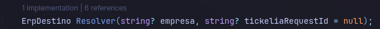
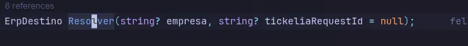
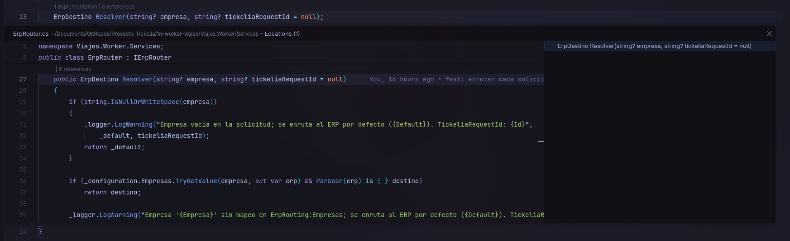

# C# Implementations CodeLens

Adds an inline **"N implementations"** CodeLens above C# interfaces, classes, and
overridable members — the row Rider's Code Vision gives you, which VS Code + C#
Dev Kit does not.

It reuses the data C# Dev Kit already computes for **Go to Implementations**
(`vscode.executeImplementationProvider`), so there is no separate language server
and no extra indexing. Clicking the lens opens a Peek view with the implementing
types.

The lens renders on the same line as C# Dev Kit's own "N references" lens, so you
get a combined `N references | N implementations` row.



**Before** — C# Dev Kit alone, references only:



Clicking the lens opens Peek with the implementing types:



## Requirements

- **C# Dev Kit** (`ms-dotnettools.csdevkit`) installed and working on your solution.
- VS Code `^1.90.0`.

## Settings

| Setting | Default | Meaning |
| --- | --- | --- |
| `csharpImplementationsCodeLens.enabled` | `true` | Show the lens. |
| `csharpImplementationsCodeLens.minCount` | `1` | Hide the lens when the implementation count is below this. |
| `csharpImplementationsCodeLens.maxFileLines` | `2000` | Skip files larger than this (performance guard). |

## Build from source

```bash
pnpm install
pnpm run package        # bundles to dist/extension.js
pnpm exec vsce package  # -> csharp-implementations-codelens-0.0.1.vsix
code --install-extension csharp-implementations-codelens-0.0.1.vsix
```

## Develop

```bash
pnpm install
pnpm run watch
```

Then press `F5` to launch an Extension Development Host, open a C# solution, and
wait for C# Dev Kit to finish loading before the counts appear.

## Notes

- Counts populate a few seconds after the solution loads; the extension re-fires
  the lenses a few times after activation and once when C# diagnostics first
  arrive.
- The declaration itself is excluded from the count (an interface with two
  implementers shows `2`, not `3`).
- Implementation lookups are cached per symbol, so scrolling within a file costs
  nothing. The cache is dropped when any C# file is saved, created, or deleted,
  when the settings change, or after 60 seconds. Empty results are never cached
  (they usually mean the language service is still warming up).

## License

MIT
